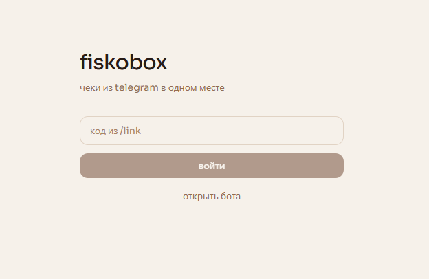
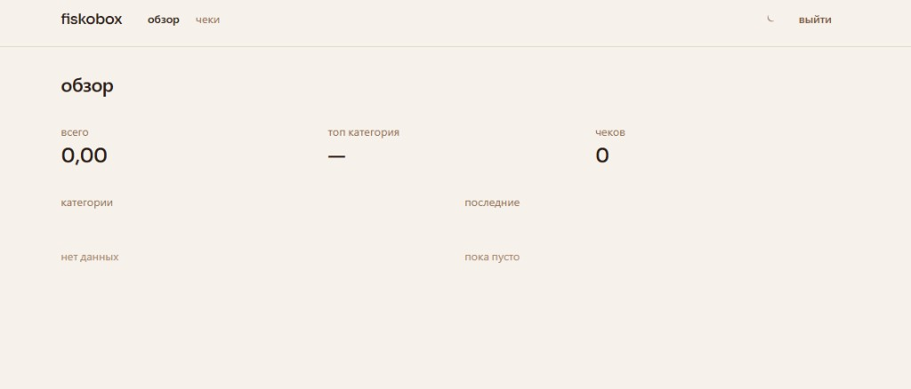
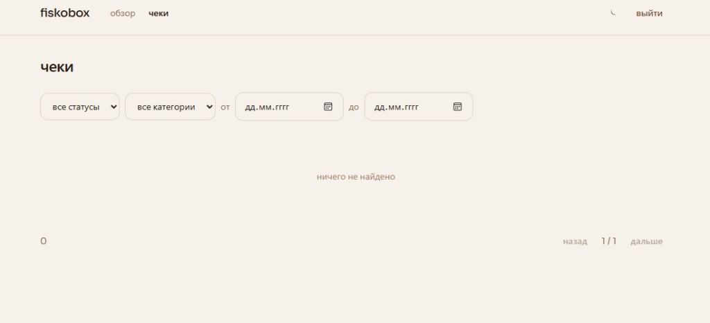
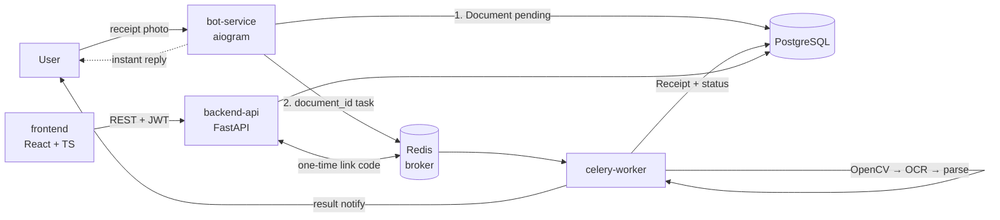

# fiskobox

Automatic expense tracking from receipt photos. Send a photo to a Telegram bot — fiskobox extracts amount, date, merchant, and category, then shows spending analytics in a minimal web dashboard.

**Stack:** Python (FastAPI, Celery, aiogram) · OpenCV + Tesseract · optional Ollama hybrid parsing · PostgreSQL + SQLAlchemy (async) · React + TypeScript + Tailwind · Docker Compose

---

## Problem

Manual expense tracking fails in practice: receipts get lost, spreadsheets feel tedious, and categorization takes time. Most apps still ask you to type every field by hand.

fiskobox reduces that to one action — **photograph the receipt and send it to the bot**. Image preprocessing, OCR, field extraction, categorization, and analytics run asynchronously in the background.

---

## Screenshots

### Login

One-time code from Telegram (`/link`) — no passwords.



### Overview

Monthly total, top category, receipt count, category breakdown, and recent receipts.



### Receipts

Filter by status, category, and date range. Edit or delete recognized fields when needed.



---

## Architecture

Independent services talk through Redis and PostgreSQL. The bot never runs OCR; the API never owns recognition; the worker never serves HTTP.



**Why bot and worker are separate containers:** they have opposite load profiles. The bot is a light I/O-bound process that must reply instantly. The worker is CPU-bound (OpenCV + OCR, hundreds of ms to seconds per receipt) with a heavier image (`tesseract-ocr`, `libgl1`). Separation enables independent scaling (`docker compose up --scale celery-worker=4`), failure isolation, and a smaller bot image.

| Service | Tech | Responsibility |
|---|---|---|
| `bot-service` | aiogram 3 | receive photos, dedupe, enqueue work |
| `celery-worker` | Celery, OpenCV, Tesseract | preprocess → OCR → parse → persist → notify |
| `backend-api` | FastAPI, SQLAlchemy async | REST dashboard, JWT, analytics, manual edits |
| `frontend` | React, TypeScript, Tailwind | overview, filters, dark/light theme |
| `postgres` / `redis` | PostgreSQL 16 / Redis 7 | storage / broker + one-time codes |

Shared ORM models, settings, structured logging, and the task contract live in the installable `shared/` package — one source of truth for services and Alembic.

---

## Technical challenges and solutions

### 1. Non-blocking UX via async pipeline

The bot **never** runs OCR in the handler — that would block the event loop for every user. The handler only does fast I/O (download, hash, create `Document`, enqueue `document_id`) and replies immediately. Heavy work goes to Celery.

Tasks use `document_id`, not raw payloads: state lives in the DB, retries stay idempotent, and progress is tracked as `pending → processing → done/failed`.

### 2. Retry with escalating preprocessing

One threshold does not fit every receipt. Celery attempt index maps to a strategy:

```
attempt 0 → adaptive gaussian threshold
attempt 1 → Otsu threshold
attempt 2 → adaptive mean threshold
```

Empty or garbage OCR (`is_meaningful` length / alphanumeric checks) triggers a retry (`max_retries=2`, 3 attempts total). After exhaustion → `failed` and a user prompt to enter data manually.

Errors are split into **retryable** (OCR quality, transient failure) and **non-retryable** (blur, multiple receipts) — the latter fail immediately.

### 3. Deskew

Phone photos are almost always rotated. Pipeline (`preprocessing/deskew.py`):

1. Binarize, invert so text is white.
2. Take text pixel coordinates and `cv2.minAreaRect` for row tilt.
3. Rotate with `warpAffine` + `BORDER_REPLICATE` to avoid black borders that confuse OCR.

Full pipeline: `grayscale → denoise → CLAHE → threshold (per attempt) → deskew`.

### 4. Edge cases

- **Blur gate** — Laplacian variance; below threshold, skip OCR and ask for a clearer photo.
- **Multiple receipts** — morphology + contour count; if more than one large block, ask to send one at a time.
- **Idempotency** — `sha256` of image bytes; resends do not duplicate work.
- **Rate limiting** — atomic Redis `INCR` + `EXPIRE`.
- **Structured logs** — JSON with `document_id`, `stage`, `attempt` for end-to-end tracing.

### 5. Passwordless web auth

`/link` creates a 6-digit code in Redis with TTL. The backend swaps it for a JWT via atomic `GETDEL`. No passwords to leak.

### 6. Async SQLAlchemy without traps

The API is fully async and uses `selectinload` (lazy loads outside a session raise `MissingGreenlet`). The worker stays sync with `psycopg` so Celery retries do not need nested `asyncio.run`.

### 7. Hybrid parsing

`PARSER_MODE=hybrid` can combine regex extraction with optional local Ollama LLM, then reconcile fields (amount, date, merchant, currency, category) when the model drifts.

---

## Quick start

Docker is enough:

```bash
cp .env.example .env
# set TELEGRAM_BOT_TOKEN and JWT_SECRET
docker compose up --build
```

Compose waits for Postgres/Redis healthchecks, runs one-shot Alembic `migrate`, then starts API, worker, bot, and frontend.

| Service | URL |
|---|---|
| Web app | http://localhost:5173 |
| API + Swagger | http://localhost:8000/docs |

Flow: message the bot `/link` → enter the code on the login page → send a receipt photo → it appears on the dashboard after processing.

Scale workers:

```bash
docker compose up --scale celery-worker=4
```

---

## Repository layout

```
fiskobox/
├── bot/              # aiogram: photos, /link, /stats
├── worker/           # Celery: OpenCV → OCR → parsing → notify
├── backend/          # FastAPI: REST, JWT, analytics
├── frontend/         # React + TypeScript + Tailwind
├── shared/           # models, settings, logging, task contract
├── migrations/       # Alembic
├── docs/             # screenshots
├── docker-compose.yml
└── .env.example
```

---

## License

See repository license file if present; otherwise all rights reserved by the author until a license is added.
